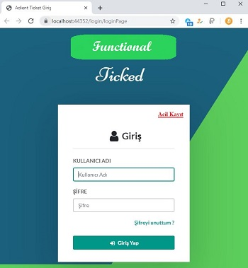
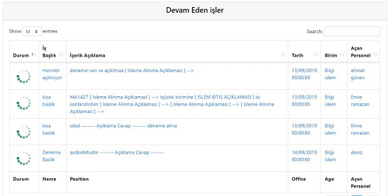

# Ticket-Portal-with-Asp.NET-MVC-

## Görev Yönetimi ve İş Takibi 
Bir kuruluş içinde Ticket Portalı yardım masası çağrı portalı yazılımını kullanmanın birçok yararı vardır. En büyük avantaj, yardım masası çağrı sürelerini azaltması ve daha hızlı çözüm süreci sunmasıdır.İş açısından bakıldığında, çağrı sürelerinin azaltılması, temsilcilerin görevlerine odaklanmalarına ve üretken kalmalarına olanak tanır. Bilgi tabanın daha etkin kullanılması, müşterilerin veya personelin ortak teknik sorunları yönetmesi için daha donanımlı hale gelir.

Bu doğrultusa söz konusu Ticket portalı, birden fazla alt bölüme (departman) sahip kurumlara uyumlu halde çalışabilmektedir. Görev yönetim sistemi olarak düşünülen Ticket portalı kurumların işlerini aksatmalarının önüne geçmeyi amaçlamaktadır.
Söz konusu portalın sahip olduğu özelliklere genel olarak değinmek gerekirse şöyle sıralayabiliriz;

<li> Yetkilendirmeli kullanım </li>
<li> Bölüm (Departman) bazlı yetkilendirmeli kullanım </li>
<li> Görev tanımlama </li>
<li> Görev ekleme / silme / erteleme / yönlendirme </li>
<li> Alt bölüme özel Görev atama </li>
<li> Alt bölümlerce yeni görev / arıza bildirimi </li>
<li> Görev süreci aşama takibi </li>
<li> Görev bitişi iki taraflı geri bildirim </li>

 

## Genel Tanıtım amaçlı sisteme ait bazı modüller.

<a  style="aligment: center;" >   Portal login ekranı</a>

  

 <a>  Yeni görev oluşturma ekranı </a>

  

 <a>  Portalın bölüm bazında kullanacağı anasayfa ekranı </a>
 
  

 <a>  İşlem sürecindeki kayıtları gösteren ekran </a>
 
  

 <a>  Görev yönlendirme ekranı </a>
 
 
  

 <a>  Görev bitiş ve son açıklama ekranı </a>
 
 
 
 
 
 
 
 
 
